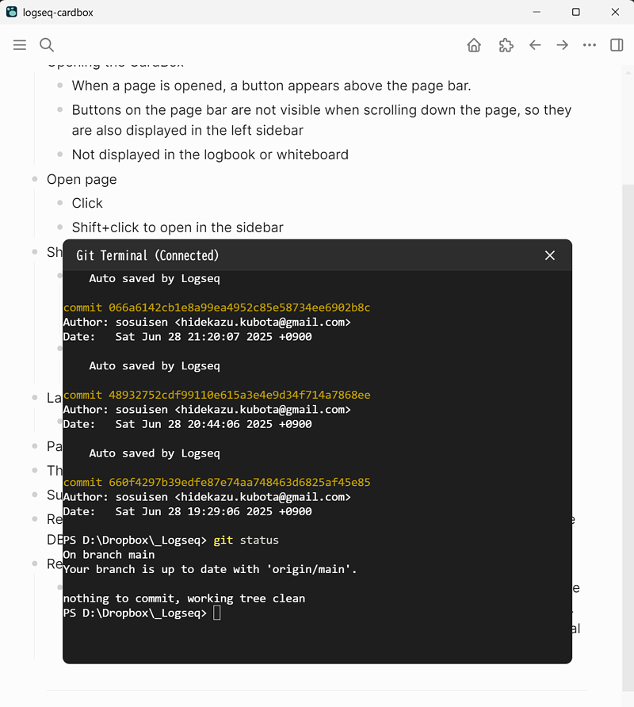

# Logseq Git Terminal Plugin

This Logseq plugin connects to ttyd to open a terminal in the working directory of your current Logseq graph. You can use git commands to operate the repository from this terminal.



# Requirements
- Git installation
- ttyd installation
- ttyd running

```
PS C:\Users\hidek> ttyd -W -p 7681 -i 127.0.0.1 -w C:\ powershell.exe
```

# Usage
- Open terminal in Logseq: Ctrl+Shift+T
- Close terminal: Click the × button in the top-right corner or type exit to disconnect.